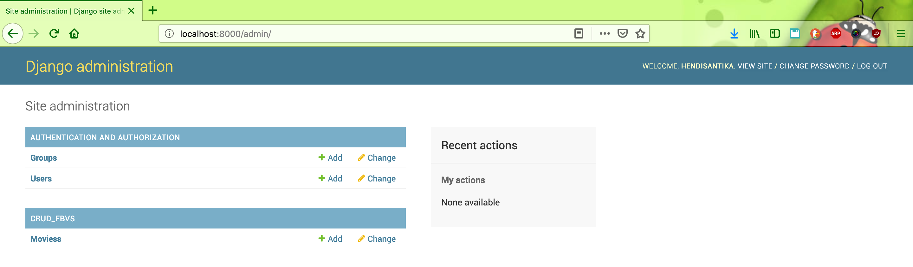
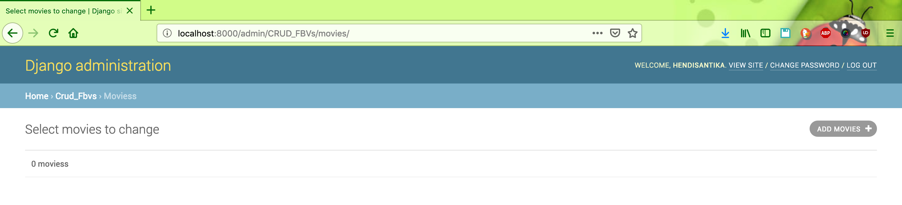
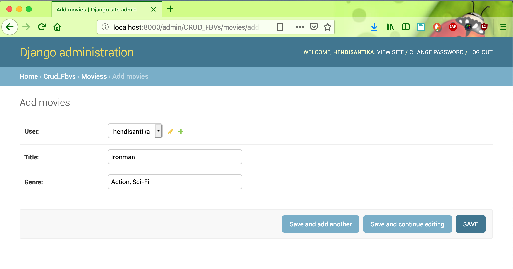
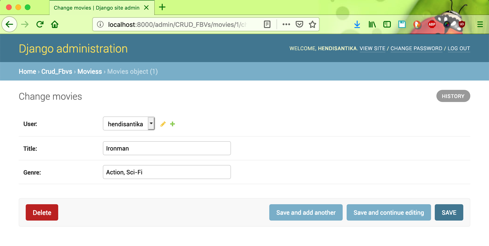
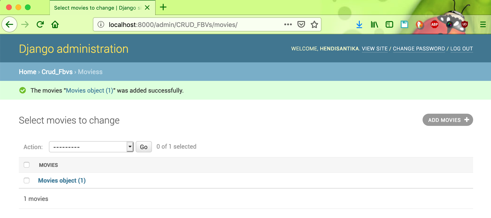

# CRUD_Django_Example

#### Things to do :
1. `git clone https://github.com/hendisantika/CRUD_Django_Example.git`
2. `cd CRUD_Django_Example`
3. `python manage.py runserver`

#### Screen shot

Login Django

Username / Password : hendisantika/hendisantika

Django Dashboard

Add new Movie

Save new Movie

Details Data

Select Data

